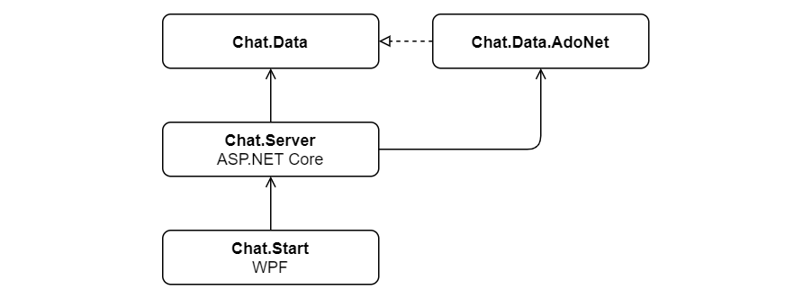

# Fancy Chat

Angular frontend SignalR chat hosted by an ASP.NET Core server run by a WPF application.

### Module dependencies

### Important

* Since `Chat.Server` module is not an executable but a library, `wwwroot` folder with static files must be copied to the folder that contains `Chat.Start` executable.

* The application uses a `dbo.Users` database table which can be created using `dbo.Users.sql` script.

* Database connection string can be configured in the `dbconfig.json` file.
